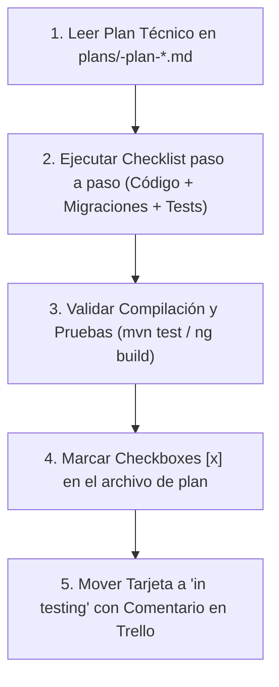

# Trello Implementer Skill

This skill guides the agent in executing the role of **`trello_implementer`** for Talentus Scout.

## Objective
Read the approved implementation plan generated by `trello_planner` inside `plans/`, write the required code and tests, verify clean compilation and automated test execution, and transition the Trello card from **`in development`** to **`in testing`**.

---

## Workflow Protocol



---

## Step-by-Step Procedure

### 1. Identify and Read the Active Plan
1. Locate the latest or specified plan file in `plans/` (e.g. `plans/TS-01-plan-configuracion-repositorios-neon.md`).
2. Read the full content using `view_file` to understand:
   * Target classes, packages, and DDL migrations.
   * DTO schemas and validation rules.
   * Acceptance Criteria and Definition of Done (DoD).
   * Checklist items in Section 7.

### 2. Execute Code Implementation
* **Backend (Spring Boot 3 / Java 21):**
  * Follow layered architecture: Entity -> Repository -> Service -> Controller.
  * Use proper Jakarta validation (`@NotBlank`, `@NotNull`, `@Pattern`, `@Positive`).
  * Flyway migrations must be placed in `src/main/resources/db/migration/V...__name.sql`.
* **Frontend (Angular 18+ Standalone):**
  * Create focused standalone components.
  * Define strict TypeScript interfaces matching the backend DTOs.
  * Ensure mobile-first responsive layout (Bento Grid aesthetic).

### 3. Verification & Automated Testing
Before marking any task as complete:
1. **Compile Backend:** Run `./mvnw clean compile` (or `mvn clean compile`).
2. **Execute Unit/Integration Tests:** Run `./mvnw test` to ensure zero regressions.
3. **Compile Frontend:** Run `npm run build` or `ng build` to ensure type-checking passes.
4. **Fix Any Lint/Compilation Errors:** Never proceed to testing status if the build is failing.

### 4. Update the Plan Checklist
Edit the corresponding `plans/<TS-ID>-plan-*.md` file:
* Mark each completed step with `[x]`.
* Add any technical notes or deviations in the plan notes section.

### 5. Transition Card in Trello to `in testing`
Run the automated helper script:
```bash
python3 .agents/skills/trello-implementer/scripts/move_to_testing.py <CARD_ID> "Implementación completada con éxito. Compilación y tests en verde."
```
Or execute via HTTP `PUT` to `https://api.trello.com/1/cards/{card_id}` with `idList=6abbbe54690c92aab5836b30`.

### 6. Final Report to the User
Report:
* Files created and modified with clickable markdown links.
* Test execution results.
* Confirmation of the Trello card status change to `in testing`.
