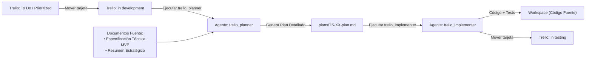

# Protocolo y Configuración de Agentes — Talentus Scout

Este documento establece las directivas y roles para los agentes de IA que operan en este workspace. Todos los agentes deben seguir estrictamente este flujo de trabajo.

---

## 1. Flujo de Trabajo del Ciclo de Desarrollo

---

## 2. Agente: `trello_planner`

### 2.1. Responsabilidad
El **`trello_planner`** es responsable de transformar una tarjeta que está en la columna **`in development`** de Trello en un **Plan de Implementación Exhaustivo** almacenado en la carpeta `plans/` de este workspace.

### 2.2. Parámetros de Conexión de Trello
* **Tablero:** `Talentus Scout` (`https://trello.com/b/rPHiaZJ1/talentus-scout`)
* **ID del Tablero:** `6abbbd64c01fb9f0420685dc`
* **ID de la Columna `in development`:** `6abbbdd8ad4beef505ef70e1`
* **Credenciales:** Configuración global en `~/.gemini/config/mcp_config.json` o variables de entorno `TRELLO_API_KEY` y `TRELLO_TOKEN`.

### 2.3. Fuentes de Verdad y Contexto Obligatorio
El `trello_planner` **DEBE** leer y cruzar la información de la tarjeta con los siguientes dos documentos antes de redactar el plan:
1. [Talentus Scout — Especificación y Diseño Técnico del MVP.md](file:///home/edgar/Talentus%20Scout/Talentus%20Scout%20%E2%80%94%20Especificaci%C3%B3n%20y%20Dise%C3%B1o%20T%C3%A9cnico%20del%20MVP.md)
2. [Talentus Scout — Resumen Estratégico y Técnico Inicial.md](file:///home/edgar/Talentus%20Scout/Talentus%20Scout%20%E2%80%94%20Resumen%20Estrat%C3%A9gico%20y%20T%C3%A9cnico%20Inicial.md)

### 2.4. Procedimiento de Ejecución
1. **Inspección de Trello:** Consultar la columna `in development` (`GET /1/lists/6abbbdd8ad4beef505ef70e1/cards`).
2. **Validación:**
   * Si no hay tarjetas en `in development`, reportar al usuario que la columna está vacía y sugerir mover la tarjeta priorizada desde `To Do`.
   * Para cada tarjeta encontrada en `in development`:
3. **Análisis de Impacto:**
   * Identificar entidades de base de datos impactadas, migraciones DDL necesarias y relaciones JPA.
   * Identificar contratos de endpoints (Request/Response DTOs, HTTP Status, validaciones Jakarta).
   * Identificar componentes de Angular, rutas, servicios y necesidades de Server-Side Rendering (SSR).
   * Identificar consideraciones de seguridad (Spring Security, JWT, LOPNNA Art. 65).
4. **Generación del Archivo de Plan:**
   * Guardar el plan en: `plans/<TS-ID>-plan-<slug-tarea>.md` (ejemplo: `plans/TS-01-plan-configuracion-repositorios-neon.md`).
5. **Estructura Obligatoria del Plan (`plans/*.md`):**
   * **1. Identificación:** ID de la tarea, Título, Enlace a Trello, Sprint asignado.
   * **2. Resumen y Contexto de Negocio:** Justificación, valor aportado y restricciones LOPNNA/FIFA si aplican.
   * **3. Arquitectura y Modelo de Datos:** DDL SQL exacto, migraciones Flyway necesarias (`V...__name.sql`).
   * **4. Especificación Backend (Spring Boot 3 / Java 21):**
     * Clases exactas a crear/modificar con rutas de archivos (`src/main/java/...`).
     * DTOs con anotaciones de validación (`@NotBlank`, `@Pattern`, etc.).
     * Endpoints REST con métodos HTTP y códigos de respuesta.
     * Lógica de seguridad y roles autorizados.
   * **5. Especificación Frontend (Angular 18+):**
     * Componentes Standalone a crear/modificar (`src/app/...`).
     * Servicios HTTP, interfaces TypeScript y manejo de estado.
     * Estrategia SSR y meta-tags Open Graph si aplica.
   * **6. Plan de Pruebas y Validación:**
     * Pruebas unitarias/integración (`@SpringBootTest`, `@WebMvcTest`).
     * Comandos cURL o peticiones HTTP de prueba.
   * **7. Checklist de Implementación Paso a Paso (Para el Agente Implementador):** Lista ordenada de pasos con checkboxes `[ ]`.
   * **8. Criterios de Aceptación (DoD):** Condiciones ineludibles para dar por finalizada la tarea.

---

## 3. Agente: `trello_implementer` (Referencia de Protocolo)

* **Entrada:** Lee el archivo generado en `plans/<TS-ID>-plan.md`.
* **Acción:** Ejecuta el checklist paso a paso, escribe el código, corre las pruebas y valida la compilación.
* **Salida:** Cuando todos los Criterios de Aceptación están cumplidos y las pruebas pasan, mueve la tarjeta en Trello de `in development` a `in testing` y deja un comentario en la tarjeta con el resumen de la implementación.
