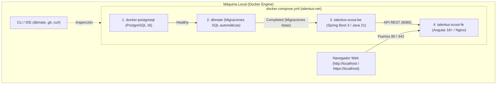

# Talentus Scout — Guía Maestra de Configuración del Entorno y Servicios

**Versión:** 3.0.0 (Orquestación Integral con Docker Compose & dbmate)  
**Fecha:** 29 de septiembre de 2026  
**Filosofía:** **Entorno Local Integral con Docker Compose.** Todo el ecosistema de desarrollo (Base de datos PostgreSQL, contenedor de migraciones dbmate, Backend Spring Boot y Frontend Angular con Nginx) se levanta y se intercomunica en una red interna de Docker (`talentus-net`). En la nube solo se crean los repositorios de GitHub al inicio; los despliegues a Neon, Cloudflare y GCP Cloud Run se realizan en la fase de promoción final.

---

## 1. Arquitectura del Entorno Local Orquestado



---

## 2. Definición Canónica del `docker-compose.yml`

Este archivo residirá en la raíz del workspace para orquestar los submódulos del proyecto:

```yaml
version: '3.8'

services:
  # 1. BASE DE DATOS LOCAL
  docker-postgresql:
    image: postgres:16-alpine
    container_name: talentus-postgres-dev
    restart: always
    environment:
      POSTGRES_USER: ${POSTGRES_USER:-postgres}
      POSTGRES_PASSWORD: ${POSTGRES_PASSWORD:-postgrespassword2026}
      POSTGRES_DB: ${POSTGRES_DB:-talentus_scout_dev}
    ports:
      - "5432:5432"
    volumes:
      - ./postgresql/data:/var/lib/postgresql/data
    networks:
      - talentus-net
    healthcheck:
      test: ["CMD-SHELL", "pg_isready -U postgres -d talentus_scout_dev"]
      interval: 5s
      timeout: 5s
      retries: 5

  # 2. CONTENEDOR DE MIGRACIONES AUTOMÁTICAS (dbmate)
  dbmate:
    image: amacneil/dbmate:latest
    container_name: talentus-dbmate
    volumes:
      - ./talentus-scout-migrations:/db
    environment:
      DATABASE_URL: "postgres://${POSTGRES_USER:-postgres}:${POSTGRES_PASSWORD:-postgrespassword2026}@docker-postgresql:5432/${POSTGRES_DB:-talentus_scout_dev}?sslmode=disable"
    depends_on:
      docker-postgresql:
        condition: service_healthy
    entrypoint: [ "/bin/sh", "-c" ]
    command: "/db/init_dbmate.sh"
    networks:
      - talentus-net

  # 3. BACKEND SPRING BOOT 3
  talentus-scout-be:
    build:
      context: ./talentus-scout-be
      dockerfile: Dockerfile
    image: talentus-scout-be:latest
    container_name: talentus-backend-dev
    ports:
      - "8080:8080"
    depends_on:
      dbmate:
        condition: service_completed_successfully
    environment:
      DB_HOST: docker-postgresql
      DB_PORT: 5432
      DB_USER: ${POSTGRES_USER:-postgres}
      DB_PWD: ${POSTGRES_PASSWORD:-postgrespassword2026}
      DB_NAME: ${POSTGRES_DB:-talentus_scout_dev}
      SPRING_PROFILES_ACTIVE: ${SPRING_PROFILES_ACTIVE:-local}
      ENCRYPTION_SECRET_KEY: ${ENCRYPTION_SECRET_KEY:-clave_secreta_local_talentus_2026}
      JWT_SECRET_KEY: ${JWT_SECRET_KEY:-super_secret_jwt_key_local_64_chars_talentus_scout_2026_dev}
    networks:
      - talentus-net

  # 4. FRONTEND ANGULAR + NGINX
  talentus-scout-fe:
    build:
      context: ./talentus-scout-fe
      dockerfile: Dockerfile
    image: talentus-scout-fe:latest
    container_name: talentus-frontend-dev
    ports:
      - "80:80"
      - "443:443"
    depends_on:
      - talentus-scout-be
    volumes:
      - ./nginx/ssl:/etc/nginx/ssl:ro
    extra_hosts:
      - "host.docker.internal:host-gateway"
    networks:
      - talentus-net

networks:
  talentus-net:
    driver: bridge
```

---

## 3. Repositorios de GitHub para el Proyecto

Para mantener el código modular, desacoplado y versionado profesionalmente, se estructuran los siguientes repositorios:

1. **`talentus-scout-migrations`:**
   * Contiene el directorio `migrations/` con las migraciones versionadas de `dbmate`, el script ejecutable `init_dbmate.sh` y el esquema canónico `schema.sql`.
   * Es el repositorio que monta el contenedor `dbmate` y el que más adelante se ejecutará contra Neon.
2. **`talentus-scout-be`:**
   * Código fuente del Backend (Spring Boot 3, Java 21, Maven Wrapper, Dockerfile multi-stage).
3. **`talentus-scout-fe`:**
   * Código fuente del Frontend (Angular 18+, Nginx config, SSL local opcional, Dockerfile).
4. **Workspace / Orquestador (`Talentus-Scout`):**
   * Contiene el `docker-compose.yml`, los scripts de arranque (`scripts/dev-up.sh`), variables `.env` y enlaza los submódulos.

---

## 4. Script de Inicialización de Migraciones (`init_dbmate.sh`)

Dentro del repositorio `talentus-scout-migrations/init_dbmate.sh`:
```bash
#!/bin/sh
set -e
echo "Iniciando proceso de migración de base de datos..."
echo "Conectando a: $DATABASE_URL"

# Espera a que el puerto de PostgreSQL responda
until dbmate --migrations-dir /db/migrations status > /dev/null 2>&1; do
  echo "Esperando que PostgreSQL acepte conexiones..."
  sleep 2
done

# Aplica las migraciones pendientes
dbmate --migrations-dir /db/migrations up
echo "Migraciones aplicadas con éxito por dbmate. Esquema sincronizado."
```

---

## 5. Matriz de Estado de Herramientas Locales

| Herramienta | Versión Instalada | Estado | Función en el Flujo |
| :--- | :--- | :---: | :--- |
| **dbmate** | v1.6.0 (`/usr/local/bin/dbmate`) | 🟢 **Listo** | CLI local y ejecutable en contenedor Docker. |
| **Docker & Compose** | Compose v2.32.3 (`/usr/local/bin/docker-compose`) | 🟢 **Listo** | Orquesta los 4 servicios en `talentus-net`. |
| **Java 21 (OpenJDK)** | 21.0.10 (`/usr/lib/jvm/...`) | 🟢 **Listo** | Desarrollo y build de Spring Boot. |
| **Node.js & npm** | Node v22.13.0, npm 10.9.2 | 🟢 **Listo** | Desarrollo de Angular 18+. |
| **Git** | v2.43.0 (`/usr/bin/git`) | 🟢 **Listo** | Gestión de repositorios locales y remotos. |
| **Trello API** | Conectado y Verificado | 🟢 **Listo** | Gestión de tarjetas con los agentes. |
| **GitHub CLI** | `gh` | ⏳ **Próxima Sesión** | `sudo apt install -y gh && gh auth login` |

---

## 6. Variables de Entorno Locales (`.env`)

```env
# ========================================================
# TALENTUS SCOUT — ENTORNO DOCKER COMPOSE LOCAL
# ========================================================

# POSTGRESQL LOCAL
POSTGRES_USER=postgres
POSTGRES_PASSWORD=postgrespassword2026
POSTGRES_DB=talentus_scout_dev
DB_HOST=docker-postgresql
DB_PORT=5432

# SPRING BOOT BACKEND
SPRING_PROFILES_ACTIVE=local
ENCRYPTION_SECRET_KEY=clave_secreta_local_talentus_2026
JWT_SECRET_KEY=super_secret_jwt_key_local_64_chars_talentus_scout_2026_dev

# PUERTOS EXTERNOS (HOST)
BACKEND_PORT=8080
FRONTEND_HTTP_PORT=80
FRONTEND_HTTPS_PORT=443
```
