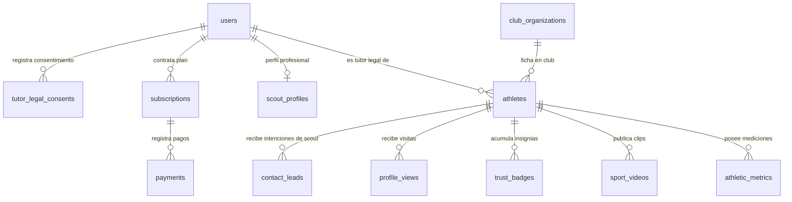

# Talentus Scout — Biblia Estratégica, de Negocio y Técnica

**Fecha de última actualización:** 29 de septiembre de 2026  
**Nombre del Producto:** Talentus Scout  
**Estado:** Documento Maestro y Fuente de Verdad del Proyecto (Single Source of Truth)  
**Mercado Objetivo Inicial:** Venezuela (Caracas / Miranda)  
**Proyección Regional:** Chile, Miami (EE. UU.) y resto de Latinoamérica  

---

## 1. Visión General y Tesis de Negocio

* **Problema:** Enorme masa de talento deportivo formativo invisible; carencia de herramientas digitales accesibles, estructuradas y profesionales para scouting, vitrina y seguimiento en Sudamérica.
* **Propuesta de Valor:** Democratizar la visibilidad del atleta joven mediante una cédula deportiva digital verificable, centralizando su perfil, métricas y material audiovisual en un formato estándar y profesional.
* **Canal de Adquisición y Tracción Inicial (Unfair Advantage):** Alianza y distribución directa con la **Asociación de Fútbol de Caracas** y sus clubes afiliados, otorgando acceso inmediato a una masa cautiva de ~15.000 atletas federados.
* **Puentes Internacionales Estratégicos:**
  * **Chile:** Red de academias formativas (puente competitivo regional).
  * **Miami (EE. UU.) / Entorno Juan Arango:** Conexión directa hacia academias de MLS Next, ligas USL y programas de becas universitarias deportivas (NCAA / NAIA).

---

## 2. El Lado de la Demanda: Scouts y Reclutadores

* **Perfil de Scouts Prioritarios:**
  * Reclutadores de las selecciones formativas de Venezuela (Vinotinto Sub-15, Sub-17, Sub-20).
  * Cuerpos técnicos y scouts de clubes de la **Liga FUTVE** (Primera y Segunda División).
  * Academias formativas aliadas en el exterior (Chile, Colombia, EE. UU.).
  * Entrenadores y "college scouts" para colocación en programas universitarios en EE. UU.
* **Política de Acceso y Acreditación de Seguridad:**
  * **100% Gratuito pero Estrictamente Verificado**. Para proteger a los atletas menores de edad y mantener la seriedad de la plataforma, el registro no es de libre acceso inmediato.
  * **Proceso de Acreditación Obligatorio:** Todo reclutador debe registrarse y adjuntar documentación que certifique su rol (carnet federativo o de club, carta institucional, acreditación de scouting o perfil profesional comprobable). Su cuenta entra en estado `PENDIENTE_VERIFICACION` y es auditada y aprobada por el equipo de administración de Talentus Scout antes de tener visibilidad sobre el directorio de atletas.
* **Mecanismo de Contacto Scout ↔ Atleta / Representante:**
  * **Canal Directo Anti-Fricción al Representante Legal (Vía WhatsApp):** El scout acreditado cuenta con un botón de contacto directo que abre WhatsApp apuntando *exclusivamente* al número telefónico verificado del representante legal (prohibido el contacto directo con el menor).
  * **Mensaje Preformateado Obligatorio:** Al pulsar el botón, se genera automáticamente un texto base estructurado y profesional:
    > *"Hola [Nombre del Representante], soy [Nombre del Scout] de [Club / Organización]. He visto el perfil de [Nombre del Atleta] en Talentus Scout y me gustaría conversar sobre su proyección deportiva."*
* **Ficha Técnica y Datos Deportivos Clave:**
  * Categoría, año de nacimiento exacto y edad cronológica.
  * Posición principal y secundaria, pierna hábil / lateralidad.
  * Club actual, minutos jugados y trayectoria deportiva.
  * Pasaportes secundarios (comunitario/europeo, estadounidense, etc.) — *factor crítico de contratación internacional*.
  * **Perfil Antropométrico y Biotipo:** Estatura, peso, envergadura, velocidad/resistencia. *(Nota: punto marcado para profundización técnica específica según el deporte).*

---

## 3. Sistema de Certificación y Confianza (Moat / Foso Defensivo)

Para evitar el "hype" sin fundamento o la alteración de datos por parte de terceros, la plataforma adopta un **modelo abierto, acumulativo y dual de multicertificación**:

* **Entidades Certificadoras Válidas:**
  1. **Club de origen:** Avala pertenencia al plantel, minutos y posición.
  2. **Asociación regional (ej. Asociación de Caracas):** Valida número de ficha federativa y estatus oficial de atleta federado.
  3. **Entrenador / Agente / Scout acreditado:** Validación técnica externa (prohibido que sea el propio padre o familiar).
  4. **Centros médicos / deportivos:** Certificación de métricas antropométricas, pruebas físicas y aptitud médica.

* **Arquitectura Operativa de Verificación (Esquema Dual):**
  * **1. Perfil / Rol de "Organización Verificadora" (Portal Especializado):**
    * Usuarios delegados de clubes, asociaciones y federaciones cuentan con un perfil institucional con privilegios de verificación.
    * Disponen de un panel donde pueden buscar a los atletas de su club/organización y estampar la validación digital oficial de ficha federativa, pertenencia al plantel y categoría con un solo clic.
  * **2. Opción Rápida / Operativa ("Fast-Track" Asistido por Admin):**
    * Para evitar cuellos de botella iniciales si un club tarda en digitalizarse o no tiene personal activo en la plataforma, el atleta o su representante puede adjuntar foto de su carnet federativo, carnet de club o constancia oficial.
    * El equipo de Talentus Scout valida directamente contra listados oficiales (cruces con archivos CSV/Excel provistos por la Asociación de Caracas) y activa la insignia de confianza desde el panel administrativo central.

* **Dinámica:** Un perfil puede acumular múltiples sellos de verificación ("Insignias de Confianza"), incrementando progresivamente su credibilidad ante los scouts.

---

## 4. Modelo de Negocio y Estrategia de Pagos

* **Estructura de Producto (B2C / B2B2C) — Monetización Activa desde el Día 1:**
  * La plataforma cobra desde el lanzamiento del piloto inicial para validar de inmediato la disposición a pagar (WTP) de las familias y garantizar la sostenibilidad operativa de la infraestructura.
  * **Cédula Deportiva Básica (Freemium):** Registro gratuito vía alianza institucional (ficha técnica estandarizada, club de pertenencia y 1 video corto de muestra transcodificado).
  * **Suscripción Pro / Pase de Temporada (Pago Activo):**
    * Soporte para 3+ videos de jugadas en alta definición con streaming adaptativo.
    * Radar de visualizaciones (notificaciones de qué scouts y clubes han visto el perfil o reproducido sus videos).
    * Descarga de CV Deportivo en PDF profesional en 1 clic.
    * Enlace web público personalizado y posición destacada en el directorio de talentos.
  * **Servicios On-Demand (Edición de Video):** Paquetes de recorte y etiquetado de jugadas destacadas. *(Pospuesto para definición y diseño operativo en etapas posteriores).*

* **Estrategia de Pagos Anti-Fricción y Conciliación Híbrida (Venezuela y Latam):**
  * **Soporte de Modalidades:** Suscripción mensual/anual recurrente y pases prepagados de temporada (3, 6 y 12 meses) para eliminar la fricción de tarjetas bancarias en Venezuela.
  * **Métodos de Pago Integrados:**
    * **Pago Móvil (Bolívares - Tasa Oficial BCV):** Flujo de reporte de referencia bancaria y captura dentro de la app, con validación rápida administrativa / semiautomatizada en el MVP.
    * **Criptoactivos:** Binance Pay / USDT (confirmación y activación automática vía webhook).
    * **Billeteras Digitales:** Zinli, Wally, Zelle (reporte de transacción y confirmación asistida).
    * **Tarjetas Internacionales:** Débito / Crédito mediante pasarela global (Stripe u operador similar) para representantes en el exterior o bancarizados internacionalmente.

---

## 5. Dinámica de Retención y Valor Percibido (Loop de la Familia)

Para evitar cancelaciones tempranas si un scout no contacta inmediatamente al jugador:

* **Feedback Continuo de Actividad:**
  * Métricas transparentes en el panel del atleta: *"Tu perfil apareció en 18 búsquedas esta semana"*, *"Un scout de Liga FUTVE reprodujo tu video"*.
* **Utilidad Inmediata "Día 1" (Sin depender de los scouts):**
  * **Enlace Público Compartible:** Página personal con diseño moderno estilo Bento/Linktree deportivo, optimizada para compartir en bio de Instagram y WhatsApp.
  * **Curriculum Vitae Deportivo (PDF en 1 Clic):** Hoja de vida deportiva estandarizada y descargable para presentar en pruebas presenciales, convocatorias y viajes.

---

## 6. Marco Legal y Protección de Menores

* **LOPNNA (Venezuela - Cumplimiento Estricto):**
  * **Art. 65:** Consentimiento expreso, inequívoco y verificable del representante legal para la publicación de imagen, videos y datos del menor.
  * La cuenta titular, de administración, autorización y facturación pertenece exclusivamente al representante legal.
  * **Protección de Datos Privados y Canalización de Contacto:** Queda estrictamente prohibida la publicación pública de datos de ubicación privada (colegio, dirección de residencia, teléfonos directos del menor). Todo enlace o botón de contacto comercial o deportivo está canalizado directa y exclusivamente hacia el teléfono de WhatsApp verificado del tutor legal.
* **Filtro de Seguridad para Scouts:** Acceso condicionado a revisión de identidad y documentación profesional para asegurar que ningún agente no acreditado acceda a la base de datos de jóvenes deportistas.
* **Normativa FIFA (Reglamento sobre el Estatuto y la Transferencia de Jugadores - RETJ):**
  * La plataforma opera estrictamente como **directorio y vitrina digital deportiva**.
  * No ejerce labores de intermediación, agencia de representación, ni cobro de comisiones por transferencia de menores.

---

## 7. Alcance del MVP Quirúrgico (Fase 1)

El objetivo es salir a canchas a validar con los primeros 100-200 atletas federados con la menor fricción técnica posible, cobrando desde el día 1 y garantizando máxima seguridad legal:

1. **Onboarding Legal del Representante:** Registro del tutor, verificación de identidad básica y firma/aceptación de términos LOPNNA.
2. **Cédula Deportiva del Atleta:** Ficha técnica estructurada (categoría, año de nacimiento, posición, club actual, pasaportes y campo para número de ficha federativa).
3. **Módulo de Video de Alto Rendimiento:** Carga optimizada de 1-2 clips cortos directo desde el móvil con transcodificación automática vía Cloudflare/Bunny.
4. **Perfil Público Compartible (Bento Deportivo):** Vista web móvil de alta fidelidad estética con botón de compartir por WhatsApp y descarga de ficha básica / CV en PDF.
5. **Módulo de Monetización y Cobro Día 1:** Activación de Cédula Básica vs. Suscripción Pro / Pase de Temporada, con recepción de pagos vía Pago Móvil (formulario de reporte de referencia), Binance Pay y pasarela internacional.
6. **Directorio Básico para Scouts Acreditados:** Vista de búsqueda y filtros rápidos (por categoría/año, club y posición), con flujo de registro de scout (`PENDIENTE_VERIFICACION` con carga de credencial) y aprobación previa por el administrador.
7. **Canal de Contacto Seguro:** Botón de WhatsApp integrado en la ficha del atleta que conecta directamente al scout con el representante legal mediante mensaje predeterminado.
8. **Módulo de Verificación Dual:**
   * Panel para **Organizaciones Verificadoras** (clubes/asociación) para validar fichas de sus atletas.
   * Flujo **Fast-Track** para carga de carnet federativo por parte del atleta y activación manual de insignias de confianza por el administrador.

---

## 8. Stack Técnico y Arquitectura de Infraestructura

La arquitectura técnica de Talentus Scout está diseñada bajo un principio de desacoplamiento modular, alta resiliencia y soberanía de datos, equilibrando costos operativos mínimos con rendimiento de nivel profesional:

```mermaid
graph TD
    ClientFE["Frontend Web / PWA (Angular 18+ SSR)"]
    CDN["Cloud CDN / Edge Delivery (Vercel / Cloudflare)"]
    API["API Gateway / Backend (Spring Boot 3 / Java 21)"]
    AuthSec["Spring Security 6 (Stateless JWT + RBAC)"]
    PostgresDB[("PostgreSQL 16 (Dbmate / Neon Serverless)")]
    MediaStorage["Cloudflare Stream / Bunny.net (Video HLS)"]

    ClientFE <-->|HTTPS / HTTP-2| CDN
    CDN <-->|REST API / JSON| API
    API --> AuthSec
    AuthSec --> API
    API <-->|HikariCP / JPA| PostgresDB
    ClientFE <-->|TUS / Direct Upload (Presigned)| MediaStorage
    API -.->|Webhooks / Status Sync| MediaStorage
```

* **Frontend:**
  * **Framework:** **Angular 18+** con soporte **SSR (Server-Side Rendering)** y Renderizado Hidratado.
  * **Propósito del SSR:** Generación ultrarrápida de vistas públicas de la cédula del atleta (`/atleta/:slug`), renderizando en el servidor los meta-tags dinámicos Open Graph (OG Title, OG Image, OG Description) para una visualización enriquecida al compartir enlaces por WhatsApp, Instagram o Twitter.
  * **Alojamiento:** Vercel, Cloudflare Pages o Firebase App Hosting con distribución global en CDN perimetral.
* **Backend:**
  * **Framework:** **Java 21 con Spring Boot 3.4.x**, estructurado en capas limpias (Domain Entities, Repositories, Services, Web Controllers, DTOs y Handlers de Excepciones).
  * **Seguridad:** Spring Security 6 con autenticación apátrida (Stateless JWT con firma HMAC-SHA384), autorización por roles (RBAC) y control de acceso a nivel de método con SpEL (`@PreAuthorize`).
  * **Despliegue de Producción:** GCP Cloud Run (contenedor Docker serverless) con autoescalado de 0 a N instancias según demanda, garantizando costes fijos cercanos a cero en valles de tráfico y escalado automático en picos de torneos.
* **Base de Datos y Persistencia:**
  * **Motor Canónico:** **PostgreSQL 16**.
  * **Producción:** **Neon Serverless PostgreSQL** con auto-suspend, pooling de conexiones transaccional vía PgBouncer y ramificaciones de bases de datos (*branching*) para validación de migraciones.
  * **Herramienta de Migración:** **Dbmate** (gestor agnóstico y declarativo de migraciones en SQL puro, ejecutado tanto en local vía Docker como en pipelines de CI/CD).
* **Almacenamiento y Streaming de Video (Núcleo Multimedia):**
  * **Servicio:** **Cloudflare Stream** o **Bunny.net Stream**.
  * **Arquitectura de Carga Directa:** Las cargas de video nunca atraviesan el backend de Spring Boot. El backend valida el consentimiento legal y cuota del atleta, genera una URL de carga directa prefirmada (vía API segura) y el navegador/móvil del usuario sube el archivo binario directamente al CDN de video mediante el protocolo resumible **TUS**.
  * **Transcodificación:** Automática a perfiles multipantalla HLS y DASH optimizados para redes móviles 3G/4G/5G con baja latencia.

---

## 9. Ecosistema de Repositorios y Topología de Código (Multi-Repo)

El código fuente del proyecto se organiza en una topología multi-repositorio desacoplada pero orquestable centralmente, alojada en la organización / usuario de GitHub `edgonbr88`:

| Repositorio | Propósito y Contenido | Tecnologías Clave | Estado en Git |
| :--- | :--- | :--- | :--- |
| **`Talentus-Scout`** (Raíz / Orquestador) | Orquestación local de Docker Compose, planes de desarrollo detallados (`plans/`), directivas de agentes IA (`.agents/`), y documentación estratégica maestra ("La Biblia"). | Docker Compose, Bash, Python, Markdown | Sincronizado (`origin/main`) |
| **`talentus-scout-migrations`** | Definición canónica del DDL en SQL puro, configuración de base de datos y migraciones versionadas ejecutadas por dbmate. | PostgreSQL 16 DDL, Dbmate, SQL | Sincronizado (`origin/main`) |
| **`talentus-scout-be`** | Microservicio backend RESTful, lógica de negocio, seguridad JWT, entidades JPA, reglas LOPNNA y validación multitenant. | Java 21, Spring Boot 3.4.x, Docker Multi-stage, Maven | Sincronizado (`origin/main`) |
| **`talentus-scout-fe`** | Aplicación web cliente, interfaz de usuario para representantes y scouts, perfiles Bento y renderizado SSR. | Angular 18+, TypeScript, Tailwind/Vanilla CSS | Planificado / En inicialización |

---

## 10. Estrategia de Ambientes y Filosofía "Local-First"

Antes de realizar despliegues a servicios en la nube de pago o con límites gratuitos sensibles (Neon, GCP, Vercel), el proyecto adopta una **política estricta de validación Local-First**:

1. **Aislamiento en Red Docker Dedicada (`talentus-net`):**
   * Todos los componentes del sistema se comunican dentro de la red tipo puente `talentus-net`.
2. **PostgreSQL Local Versionado:**
   * Contenedor `talentus-postgres-dev` basado en `postgres:16-alpine`, con persistencia en volumen Docker local y puerto 5432 expuesto.
3. **Pipeline Automático de Migración en Arranque:**
   * Contenedor efímero `talentus-dbmate` que se ejecuta sobre `talentus-scout-migrations`, esperando a que Postgres esté en estado `healthy` para aplicar todas las migraciones DDL (`dbmate up`) antes de permitir el inicio de cualquier servicio dependiente.
4. **Backend Contenerizado Multi-Stage:**
   * Contenedor `talentus-backend-dev` que compila el código fuente Java con Maven en una etapa de construcción (`eclipse-temurin:21-jdk-alpine`) y empaqueta el binario final en una imagen ligera de ejecución (`eclipse-temurin:21-jre-alpine`), corriendo bajo un usuario sin privilegios de root (`talentus`).
5. **Transición hacia la Nube:**
   * Una vez estabilizado y testeado el comportamiento funcional en local (100% de suites de prueba verdes), el esquema de Dbmate se aplica idénticamente sobre Neon Serverless y el contenedor se publica en el registro de contenedores de GCP para ser levantado en Cloud Run.

---

## 11. Modelo Canónico de Datos y Reglas de Integridad (PostgreSQL 16)

El modelo de datos relacional está formalizado en [20260929171117_create_initial_schema.sql](file:///home/edgar/Talentus%20Scout/talentus-scout-migrations/migrations/20260929171117_create_initial_schema.sql) y comprende **12 tablas relacionales**, **9 tipos enumerados nativos (ENUMs)** y **5 índices especializados**:



### 11.1. Tablas y Entidades del Sistema
1. **`users`:** Cuentas maestras del sistema con autenticación por email, hash bcrypt de contraseña, rol principal (`user_role`) y estado de cuenta (`account_status`). Clave foránea referencial para auditoría.
2. **`tutor_legal_consents`:** Bitácora jurídica inmutable del consentimiento LOPNNA Art. 65. Registra el `user_id` del tutor, cédula de identidad, relación de tutela (`PADRE`, `MADRE`, `REPRESENTANTE_LEGAL`), timestamp exacto, dirección IP del cliente y cadena User-Agent del navegador.
3. **`club_organizations`:** Directorio de clubes, academias y escuelas deportivas con su código de afiliación federativa (FVF), estado geográfico y bandera de verificación oficial.
4. **`athletes`:** Cédula deportiva digital del menor. Incluye `tutor_id` obligatorio, `slug` único para SEO, posición principal y secundaria, lateralidad (`dominant_foot`), biometría (estatura, peso), pasaportes secundarios y número de ficha federativa.
5. **`athletic_metrics`:** Registro histórico versionado de pruebas físicas (velocidad 30m, salto vertical, VO2 max, envergadura, etc.) asociadas a la entidad o laboratorio certificador.
6. **`sport_videos`:** Catálogo de highlights y jugadas del atleta con ID de video externo en CDN, estado de procesamiento (`READY`, `PROCESSING`), URLs HLS y bandera de video destacado.
7. **`trust_badges`:** Insignias de confianza otorgadas a un atleta por un club, asociación o administrador (`CLUB_OFFICIAL`, `ASSOCIATION_VERIFIED`, `SCOUT_ENDORSED`), implementando el foso defensivo de verificación dual.
8. **`scout_profiles`:** Perfil profesional de los scouts y reclutadores, con organización de origen, documento de acreditación y estado de auditoría (`PENDING_APPROVAL`, `APPROVED`, `REJECTED`).
9. **`subscriptions`:** Suscripciones activas (`FREE`, `PRO`, `SEASON_PASS`) vinculadas al usuario pagador y al atleta beneficiario.
10. **`payments`:** Transacciones financieras multimoneda (USD / VED) con método de pago (`PAGO_MOVIL`, `BINANCE_PAY`, `ZELLE`, `STRIPE`), número de referencia externa, comprobante y estado de conciliación.
11. **`profile_views`:** Registro de telemetría de visualizaciones de perfiles por scouts para retroalimentar el loop de retención de las familias.
12. **`contact_leads`:** Registro de clics en el botón de WhatsApp hacia el representante para auditar el interés comercial y deportivo generado por el atleta.

### 11.2. Mapeo de ENUMs en Java / JPA
Para evitar incompatibilidades entre los tipos ENUM nativos de PostgreSQL y Hibernate 6/7, los campos enumerados en las entidades JPA utilizan explícitamente:
```java
@Enumerated(EnumType.STRING)
@JdbcTypeCode(SqlTypes.NAMED_ENUM)
private UserRole role;
```

---

## 12. Arquitectura de Seguridad, Identidad y Blindaje Legal (LOPNNA Art. 65)

Talentus Scout maneja datos de menores de edad en el contexto de la legislación venezolana e internacional, por lo que su arquitectura de seguridad aplica principios de defensa en profundidad:

### 12.1. Autenticación y Autorización (Spring Security 6)
* **Tokens Apátridas (Stateless JWT):**
  * Los tokens se firman mediante el algoritmo HMAC-SHA384 con expiración estricta de 24 horas (`86400s`).
  * El payload incluye claims esenciales: `userId`, `sub` (email), `role` y `fullName`.
* **Seguridad a Nivel de Método (SpEL & Ownership):**
  * Para prevenir vulnerabilidades de referencia directa a objetos insegura (IDOR), la manipulación y consulta privada de atletas está blindada mediante una expresión SpEL delegada en el componente `AthleteSecurity`:
  ```java
  @PreAuthorize("@athleteSecurity.isOwner(#id, authentication)")
  ```
  * `AthleteSecurity.isOwner()` evalúa transaccionalmente que el `tutor.id` del atleta coincida con el ID del usuario extraído del JWT (o que el usuario ostente el rol `ROLE_ADMIN`), denegando cualquier intento ajeno con un código HTTP `403 Forbidden`.

### 12.2. Registro Atómico de Onboarding del Tutor
El endpoint `POST /api/v1/auth/register-tutor` ejecuta en una única transacción atómica (`@Transactional`):
1. Validación de unicidad de correo y número de cédula.
2. Validación de formato de teléfono bajo estándar internacional E.164 (`+58...`).
3. Creación del usuario con rol `TUTOR` y contraseña cifrada con BCrypt.
4. Generación inmutable del registro en `tutor_legal_consents` capturando la IP y User-Agent desde el servlet request.
5. Emisión inmediata del JWT para permitir que el tutor cree inmediatamente la cédula de sus representados sin fricciones adicionales.

---

## 13. Cédula Deportiva: Identidad Digital y Algoritmo de Slug Único

Cada atleta registrado en Talentus Scout recibe un identificador amigable único denominado `slug` que servirá de ruta para su cédula pública: `talentus.app/atleta/:slug`.

### 13.1. Algoritmo de Normalización y Resolución de Colisiones (`SlugService`)
1. **Normalización Unicode:** Descompone caracteres con tildes o diacríticos (`Normalizer.normalize(name, Normalizer.Form.NFD)`), eliminando marcas no espaciadas mediante la expresión regular `\p{InCombiningDiacriticalMarks}+`.
2. **Saneamiento URL-Safe:** Convierte a minúsculas, reemplaza caracteres no alfanuméricos por guiones simples y elimina guiones redundantes en los extremos.
   * *Ejemplo:* `"Gabriel José Pérez"` → `"gabriel-jose-perez"`.
3. **Resolución Determinista de Colisiones:**
   * Si la consulta `athleteRepository.findBySlug(baseSlug)` no arroja resultados, se asigna el slug base.
   * Si el slug ya existe, se genera un sufijo numérico incremental verificando la existencia en bucle: `"gabriel-jose-perez-1"`, `"gabriel-jose-perez-2"`, etc.

---

## 14. Estimación de Costos Operativos por Escenario

| Escenario | Atletas Activos | Video Almacenado (6 min c/u) | Streaming Estimado | Costo Total Infraestructura |
| :--- | :--- | :--- | :--- | :--- |
| **Piloto / Validación** | 1.000 | 6.000 min | 60.000 min | **~$125 – $130 USD/mes** |
| **Tracción Media** | 5.000 | 30.000 min | 300.000 min | **~$505 – $530 USD/mes** |
| **Escala Completa** | 15.000 | 90.000 min | 900.000 min | **~$1.450 – $1.550 USD/mes** |

*Costo marginal de infraestructura por atleta: ~$0.10 - $0.12 USD/mes.*  
*Una tasa de conversión del 3% al 5% en suscripciones o pases de temporada de $3 a $5 USD/mes financia la totalidad de la infraestructura y genera margen operativo positivo.*

---

## 15. Protocolo de Desarrollo y Gobernanza de Agentes de IA

El desarrollo de la plataforma se rige por un flujo riguroso y automatizado que conecta el tablero de gestión de proyectos (Trello) con los agentes autónomos de codificación en este workspace:

1. **`trello_planner`:**
   * Inspecciona las tarjetas en la lista `in development` de Trello.
   * Contrasta los requerimientos con este documento ("La Biblia"), el DDL de base de datos y la especificación del MVP.
   * Produce un documento exhaustivo de diseño y lista de comprobación en `plans/TS-XX-plan-<slug>.md`.
2. **`trello_implementer`:**
   * Toma el plan generado y ejecuta paso a paso la implementación del código fuente (backend, base de datos, frontend).
   * Valida la suite de pruebas unitarias y de integración (`./mvnw clean test`), garantizando el 100% de aserciones exitosas.
   * Levanta y valida los servicios en los contenedores Docker locales (`docker compose up --build -d`).
   * Realiza commits y push a los repositorios remotos en GitHub (`edgonbr88/*`).
   * Desplaza la tarjeta en Trello de `in development` a `in testing` y anota un comentario con el balance técnico de la entrega.

