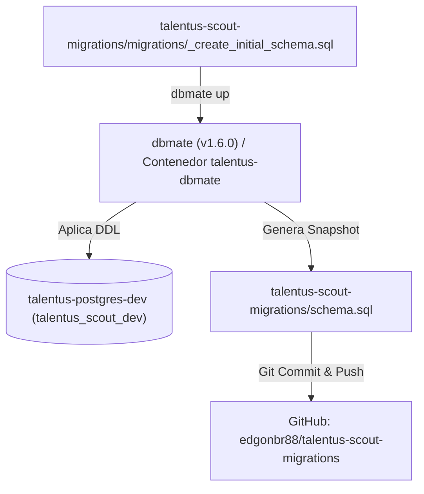

# Plan de Implementación: [TS-02] Esquema DDL Canónico de Talentus Scout con dbmate

**ID Tarea:** TS-02  
**Tarjeta Trello:** [Ver en Trello](https://trello.com/c/QPWPF01R/39-ts-02-esquema-ddl-can%C3%B3nico-de-talentus-scout-con-dbmate-users-lopnna-athletes-badges-videos-pagos) (ID: `6abbe1f240d05a4803af72a8`)  
**Fecha:** 29 de septiembre de 2026  
**Sprint:** Sprint 1 — Cimientos Locales  
**Estado del Plan:** COMPLETADO  
**Agente Planificador:** trello_planner  
**Agente Implementador:** trello_implementer  

---

## 1. Contexto de Negocio y Justificación

* **Problema:** Un esquema de base de datos mal modelado o dependiente del ORM puede introducir fugas de privacidad de menores de edad, inconsistencias de tipo en campos críticos (ej. fechas de nacimiento, lateralidad, estados de verificación) o sobrecargar el backend.
* **Solución:** Crear la migración SQL fundacional con **`dbmate`** conteniendo el DDL canónico validado en la especificación técnica. Toda la estructura relacional queda inmutable, tipada con ENUMs de PostgreSQL, con claves foráneas con reglas de borrado seguras (`CASCADE` o `SET NULL`) e índices de alta velocidad para búsquedas de scouts.
* **Aspectos Legales y de Negocio Clave:**
  * **LOPNNA (Art. 65):** Tabla `tutor_legal_consents` separada e inmutable, con registro de IP y User-Agent.
  * **Separación de Identidades:** Adultos (tutores, scouts, verificadores) en `users` vs. menores en `athletes`.
  * **Multicertificación:** `athlete_badges` vincula el tipo de insignia con la organización o verificador acreditado.

---

## 2. Arquitectura de Migración con dbmate



---

## 3. Especificación Técnica del DDL (Migración Inicial)

### 3.1. Archivo de Migración: `talentus-scout-migrations/migrations/YYYYMMDDHHMMSS_create_initial_schema.sql`

```sql
-- migrate:up
-- 1. EXTENSIONES Y TIPOS ENUMERADOS
CREATE EXTENSION IF NOT EXISTS "uuid-ossp";

CREATE TYPE user_role AS ENUM ('TUTOR', 'SCOUT', 'VERIFIER_ORG', 'ADMIN');
CREATE TYPE account_status AS ENUM ('PENDING_VERIFICATION', 'ACTIVE', 'SUSPENDED');
CREATE TYPE scout_verification_status AS ENUM ('PENDING', 'APPROVED', 'REJECTED');
CREATE TYPE video_status AS ENUM ('PENDING_UPLOAD', 'PROCESSING', 'READY', 'FAILED');
CREATE TYPE badge_type AS ENUM ('FEDERATION_LICENSE', 'CLUB_AFFILIATION', 'MEDICAL_ANTHRO', 'SCOUT_ENDORSEMENT');
CREATE TYPE badge_status AS ENUM ('PENDING', 'APPROVED', 'REJECTED');
CREATE TYPE payment_method AS ENUM ('PAGO_MOVIL', 'BINANCE_PAY', 'ZINLI_WALLY_ZELLE', 'STRIPE');
CREATE TYPE payment_status AS ENUM ('PENDING_AUDIT', 'APPROVED', 'REJECTED', 'AUTO_CONFIRMED');
CREATE TYPE subscription_status AS ENUM ('ACTIVE', 'EXPIRED', 'CANCELLED');

-- 2. USUARIOS ADULTOS (Tutores, Scouts, Verificadores, Admins)
CREATE TABLE users (
    id UUID PRIMARY KEY DEFAULT uuid_generate_v4(),
    email VARCHAR(255) UNIQUE NOT NULL,
    password_hash VARCHAR(255) NOT NULL,
    full_name VARCHAR(150) NOT NULL,
    phone_number VARCHAR(30) NOT NULL,
    role user_role NOT NULL DEFAULT 'TUTOR',
    status account_status NOT NULL DEFAULT 'ACTIVE',
    created_at TIMESTAMP WITH TIME ZONE DEFAULT CURRENT_TIMESTAMP,
    updated_at TIMESTAMP WITH TIME ZONE DEFAULT CURRENT_TIMESTAMP
);

-- 3. CONSENTIMIENTO LOPNNA (Art. 65)
CREATE TABLE tutor_legal_consents (
    id UUID PRIMARY KEY DEFAULT uuid_generate_v4(),
    tutor_id UUID NOT NULL REFERENCES users(id) ON DELETE CASCADE,
    accepted_lopnna_terms BOOLEAN NOT NULL DEFAULT TRUE,
    terms_version VARCHAR(20) NOT NULL DEFAULT '1.0',
    ip_address VARCHAR(45) NOT NULL,
    user_agent TEXT NOT NULL,
    accepted_at TIMESTAMP WITH TIME ZONE DEFAULT CURRENT_TIMESTAMP
);

-- 4. CLUBES Y ORGANIZACIONES
CREATE TABLE clubs_organizations (
    id UUID PRIMARY KEY DEFAULT uuid_generate_v4(),
    name VARCHAR(150) NOT NULL,
    federation_code VARCHAR(50),
    city VARCHAR(100) NOT NULL,
    state VARCHAR(100) NOT NULL,
    country VARCHAR(100) NOT NULL DEFAULT 'Venezuela',
    logo_url TEXT,
    verified_official BOOLEAN NOT NULL DEFAULT FALSE,
    created_at TIMESTAMP WITH TIME ZONE DEFAULT CURRENT_TIMESTAMP
);

-- 5. DELEGADOS VERIFICADORES
CREATE TABLE verifier_delegates (
    id UUID PRIMARY KEY DEFAULT uuid_generate_v4(),
    user_id UUID NOT NULL REFERENCES users(id) ON DELETE CASCADE,
    organization_id UUID NOT NULL REFERENCES clubs_organizations(id) ON DELETE CASCADE,
    position_title VARCHAR(100) NOT NULL,
    is_active BOOLEAN NOT NULL DEFAULT TRUE,
    created_at TIMESTAMP WITH TIME ZONE DEFAULT CURRENT_TIMESTAMP,
    CONSTRAINT unique_user_org UNIQUE (user_id, organization_id)
);

-- 6. ATLETAS (Menores de edad)
CREATE TABLE athletes (
    id UUID PRIMARY KEY DEFAULT uuid_generate_v4(),
    tutor_id UUID NOT NULL REFERENCES users(id) ON DELETE CASCADE,
    first_name VARCHAR(100) NOT NULL,
    last_name VARCHAR(100) NOT NULL,
    birth_date DATE NOT NULL,
    gender VARCHAR(10) NOT NULL DEFAULT 'MALE',
    primary_position VARCHAR(50) NOT NULL,
    secondary_position VARCHAR(50),
    preferred_foot VARCHAR(20) NOT NULL,
    nationality VARCHAR(50) NOT NULL DEFAULT 'Venezolana',
    secondary_passports VARCHAR(150),
    current_club_id UUID REFERENCES clubs_organizations(id) ON DELETE SET NULL,
    federation_license_number VARCHAR(50),
    height_cm NUMERIC(5,2),
    weight_kg NUMERIC(5,2),
    profile_photo_url TEXT,
    bio TEXT,
    slug VARCHAR(120) UNIQUE NOT NULL,
    is_public BOOLEAN NOT NULL DEFAULT TRUE,
    created_at TIMESTAMP WITH TIME ZONE DEFAULT CURRENT_TIMESTAMP,
    updated_at TIMESTAMP WITH TIME ZONE DEFAULT CURRENT_TIMESTAMP
);

-- 7. INSIGNIAS DE CONFIANZA (Certificaciones)
CREATE TABLE athlete_badges (
    id UUID PRIMARY KEY DEFAULT uuid_generate_v4(),
    athlete_id UUID NOT NULL REFERENCES athletes(id) ON DELETE CASCADE,
    badge_type badge_type NOT NULL,
    organization_id UUID REFERENCES clubs_organizations(id) ON DELETE SET NULL,
    verified_by_user_id UUID REFERENCES users(id) ON DELETE SET NULL,
    status badge_status NOT NULL DEFAULT 'PENDING',
    evidence_document_url TEXT,
    verification_notes TEXT,
    verified_at TIMESTAMP WITH TIME ZONE,
    created_at TIMESTAMP WITH TIME ZONE DEFAULT CURRENT_TIMESTAMP
);

-- 8. VIDEOS DE JUGADAS DESTACADAS
CREATE TABLE athlete_videos (
    id UUID PRIMARY KEY DEFAULT uuid_generate_v4(),
    athlete_id UUID NOT NULL REFERENCES athletes(id) ON DELETE CASCADE,
    title VARCHAR(150) NOT NULL,
    category VARCHAR(50) NOT NULL DEFAULT 'HIGHLIGHTS',
    provider_video_id VARCHAR(100) NOT NULL,
    playback_url TEXT,
    thumbnail_url TEXT,
    duration_seconds INT DEFAULT 0,
    status video_status NOT NULL DEFAULT 'PENDING_UPLOAD',
    sort_order INT NOT NULL DEFAULT 1,
    created_at TIMESTAMP WITH TIME ZONE DEFAULT CURRENT_TIMESTAMP
);

-- 9. PERFILES DE SCOUTS
CREATE TABLE scout_profiles (
    id UUID PRIMARY KEY DEFAULT uuid_generate_v4(),
    user_id UUID UNIQUE NOT NULL REFERENCES users(id) ON DELETE CASCADE,
    organization_name VARCHAR(150) NOT NULL,
    scout_role VARCHAR(100) NOT NULL,
    credentials_document_url TEXT NOT NULL,
    linkedin_url TEXT,
    verification_status scout_verification_status NOT NULL DEFAULT 'PENDING',
    reviewed_by_admin_id UUID REFERENCES users(id) ON DELETE SET NULL,
    reviewed_at TIMESTAMP WITH TIME ZONE,
    rejection_reason TEXT,
    created_at TIMESTAMP WITH TIME ZONE DEFAULT CURRENT_TIMESTAMP
);

-- 10. PLANES Y SUSCRIPCIONES
CREATE TABLE subscription_plans (
    id VARCHAR(50) PRIMARY KEY,
    name VARCHAR(100) NOT NULL,
    price_usd NUMERIC(10,2) NOT NULL DEFAULT 0.00,
    duration_days INT NOT NULL DEFAULT 30,
    max_videos INT NOT NULL DEFAULT 1,
    has_radar_views BOOLEAN NOT NULL DEFAULT FALSE,
    has_pdf_cv BOOLEAN NOT NULL DEFAULT FALSE,
    is_active BOOLEAN NOT NULL DEFAULT TRUE
);

CREATE TABLE athlete_subscriptions (
    id UUID PRIMARY KEY DEFAULT uuid_generate_v4(),
    athlete_id UUID NOT NULL REFERENCES athletes(id) ON DELETE CASCADE,
    plan_id VARCHAR(50) NOT NULL REFERENCES subscription_plans(id),
    start_date TIMESTAMP WITH TIME ZONE NOT NULL DEFAULT CURRENT_TIMESTAMP,
    end_date TIMESTAMP WITH TIME ZONE NOT NULL,
    status subscription_status NOT NULL DEFAULT 'ACTIVE',
    created_at TIMESTAMP WITH TIME ZONE DEFAULT CURRENT_TIMESTAMP
);

-- 11. TRANSACCIONES DE PAGO
CREATE TABLE payment_transactions (
    id UUID PRIMARY KEY DEFAULT uuid_generate_v4(),
    user_id UUID NOT NULL REFERENCES users(id) ON DELETE CASCADE,
    athlete_id UUID NOT NULL REFERENCES athletes(id) ON DELETE CASCADE,
    plan_id VARCHAR(50) NOT NULL REFERENCES subscription_plans(id),
    method payment_method NOT NULL,
    amount_usd NUMERIC(10,2) NOT NULL,
    amount_ves NUMERIC(15,2),
    bcv_exchange_rate NUMERIC(10,4),
    reference_number VARCHAR(100),
    proof_image_url TEXT,
    status payment_status NOT NULL DEFAULT 'PENDING_AUDIT',
    audited_by_admin_id UUID REFERENCES users(id) ON DELETE SET NULL,
    audited_at TIMESTAMP WITH TIME ZONE,
    rejection_reason TEXT,
    created_at TIMESTAMP WITH TIME ZONE DEFAULT CURRENT_TIMESTAMP
);

-- 12. LOGS DE ACTIVIDAD DE SCOUTS (Radar)
CREATE TABLE scout_activity_logs (
    id UUID PRIMARY KEY DEFAULT uuid_generate_v4(),
    scout_id UUID NOT NULL REFERENCES users(id) ON DELETE CASCADE,
    athlete_id UUID NOT NULL REFERENCES athletes(id) ON DELETE CASCADE,
    video_id UUID REFERENCES athlete_videos(id) ON DELETE SET NULL,
    activity_type VARCHAR(50) NOT NULL,
    created_at TIMESTAMP WITH TIME ZONE DEFAULT CURRENT_TIMESTAMP
);

-- ÍNDICES DE RENDIMIENTO Y BÚSQUEDA
CREATE INDEX idx_athletes_slug ON athletes(slug);
CREATE INDEX idx_athletes_filter ON athletes(birth_date, primary_position, current_club_id);
CREATE INDEX idx_videos_athlete ON athlete_videos(athlete_id, sort_order);
CREATE INDEX idx_badges_athlete ON athlete_badges(athlete_id, status);
CREATE INDEX idx_scout_activity ON scout_activity_logs(athlete_id, created_at DESC);

-- migrate:down
DROP TABLE IF EXISTS scout_activity_logs CASCADE;
DROP TABLE IF EXISTS payment_transactions CASCADE;
DROP TABLE IF EXISTS athlete_subscriptions CASCADE;
DROP TABLE IF EXISTS subscription_plans CASCADE;
DROP TABLE IF EXISTS scout_profiles CASCADE;
DROP TABLE IF EXISTS athlete_videos CASCADE;
DROP TABLE IF EXISTS athlete_badges CASCADE;
DROP TABLE IF EXISTS athletes CASCADE;
DROP TABLE IF EXISTS verifier_delegates CASCADE;
DROP TABLE IF EXISTS clubs_organizations CASCADE;
DROP TABLE IF EXISTS tutor_legal_consents CASCADE;
DROP TABLE IF EXISTS users CASCADE;

DROP TYPE IF EXISTS subscription_status;
DROP TYPE IF EXISTS payment_status;
DROP TYPE IF EXISTS payment_method;
DROP TYPE IF EXISTS badge_status;
DROP TYPE IF EXISTS badge_type;
DROP TYPE IF EXISTS video_status;
DROP TYPE IF EXISTS scout_verification_status;
DROP TYPE IF EXISTS account_status;
DROP TYPE IF EXISTS user_role;
```

---

## 4. Plan de Pruebas y Validación

1. **Prueba de Creación y Aplicación:**
   * Ejecutar: `dbmate --migrations-dir ./migrations up`
   * Esperado: 12 tablas creadas, sin errores de sintaxis en PostgreSQL 16.
2. **Prueba de Reversibilidad (Rollback):**
   * Ejecutar: `dbmate --migrations-dir ./migrations rollback`
   * Esperado: Todas las tablas y tipos eliminados limpiamente.
3. **Prueba de Reaplicación:**
   * Ejecutar: `dbmate --migrations-dir ./migrations up`
   * Esperado: Esquema reconstruido idéntico.
4. **Verificación de Contenedor Docker:**
   * Ejecutar: `docker compose up dbmate`
   * Esperado: El contenedor ejecuta `init_dbmate.sh` y detecta y aplica la migración.
5. **Verificación de `schema.sql`:**
   * Confirmar que `talentus-scout-migrations/schema.sql` se ha generado y contiene el volcado completo.

---

## 5. Checklist de Implementación Paso a Paso (Para `trello_implementer`)

- [x] **Paso 1:** Generar archivo de migración con `dbmate new create_initial_schema`.
- [x] **Paso 2:** Escribir el DDL completo (`-- migrate:up` y `-- migrate:down`) en el archivo generado.
- [x] **Paso 3:** Aplicar la migración contra PostgreSQL local (`talentus-postgres-dev`) y validar `schema.sql`.
- [x] **Paso 4:** Probar ciclo completo de `rollback` y `up` para certificar reversibilidad.
- [x] **Paso 5:** Probar que el contenedor `docker compose up dbmate` ejecuta y finaliza con éxito.
- [x] **Paso 6:** Hacer commit y push en el repositorio `talentus-scout-migrations` en GitHub.
- [x] **Paso 7:** Validar Criterios de Aceptación (DoD) y ejecutar `move_to_testing.py 6abbe1f240d05a4803af72a8`.

---

## 6. Criterios de Aceptación (Definition of Done - DoD)

1. Las 12 tablas y 9 tipos enumerados existen en la base de datos `talentus_scout_dev`.
2. Las claves foráneas y restricciones `CASCADE` y `SET NULL` funcionan correctamente.
3. `dbmate up` y `dbmate rollback` son completamente deterministas.
4. El archivo canónico `schema.sql` está versionado y subido al repositorio GitHub `edgonbr88/talentus-scout-migrations`.
5. La tarjeta `[TS-02]` se traslada a la columna **`in testing`** en Trello con su respectivo comentario de resumen.
