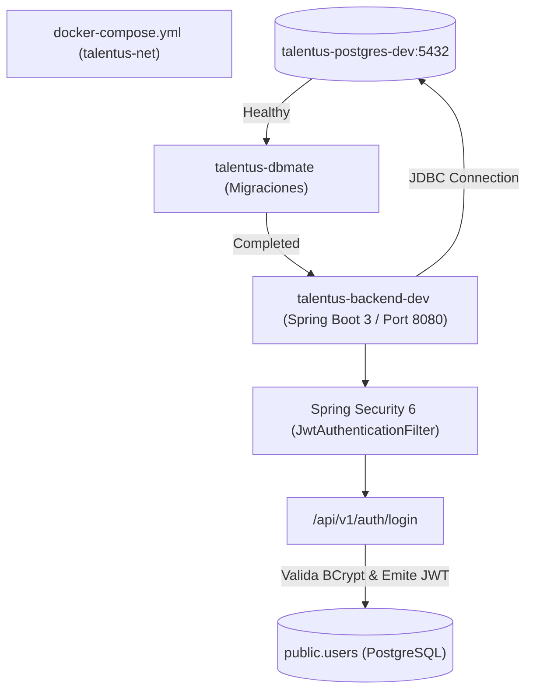

# Plan de Implementación: [TS-03] Inicialización del Backend Spring Boot (talentus-scout-be) en Docker Compose con Spring Security 6

**ID Tarea:** TS-03  
**Tarjeta Trello:** [Ver en Trello](https://trello.com/c/52d0yQZ2/40-ts-03-inicializaci%C3%B3n-del-backend-spring-boot-talentus-scout-be-en-docker-compose-con-spring-security-6) (ID: `6abbe1f34db1dfac6cf49247`)  
**Fecha:** 29 de septiembre de 2026  
**Sprint:** Sprint 1 — Cimientos Locales  
**Estado del Plan:** COMPLETADO  
**Agente Planificador:** trello_planner  
**Agente Implementador:** trello_implementer  

---

## 1. Contexto de Negocio y Justificación

* **Problema:** Talentus Scout maneja datos sensibles de menores de edad (atletas infantiles y juveniles) protegidos bajo la LOPNNA (Art. 65), credenciales de scouts profesionales, verificaciones deportivas y flujos de pago. Requiere un núcleo backend robusto, fuertemente tipado, con control de acceso granular por roles (RBAC) y ejecución sin estado (Stateless) mediante JSON Web Tokens (JWT).
* **Solución:** Inicializar el microservicio backend **`talentus-scout-be`** utilizando **Spring Boot 3.3+ (Java 21)** y **Spring Security 6**, completamente containerizado e integrado al orquestador `docker-compose.yml` en la red `talentus-net`.
* **Garantías de Integración:**
  * El servicio backend arranca **exclusivamente después** de que el contenedor `talentus-dbmate` haya completado exitosamente las migraciones (`condition: service_completed_successfully`).
  * Utiliza `spring.jpa.hibernate.ddl-auto=validate`, asegurando que el modelo JPA se adhiere estrictamente al DDL canónico versionado en `dbmate` sin alterar la base de datos en tiempo de ejecución.

---

## 2. Alcance Técnico y Arquitectura



---

## 3. Modelo de Datos y Entidad JPA

Dado que la tabla canónica `users` y el ENUM `user_role` ya fueron creados en la base de datos por `dbmate` en `TS-02`, el backend mapeará la entidad JPA `User`:

### 3.1. Entidad JPA: `com.talentus.scout.domain.entity.User`
* `id` (`UUID`, `@GeneratedValue(strategy = GenerationType.UUID)`)
* `email` (`String`, no nulo, único)
* `passwordHash` (`String`, no nulo)
* `fullName` (`String`, no nulo)
* `phoneNumber` (`String`, no nulo)
* `role` (`UserRole` ENUM: `TUTOR`, `SCOUT`, `VERIFIER_ORG`, `ADMIN`)
* `status` (`AccountStatus` ENUM: `PENDING_VERIFICATION`, `ACTIVE`, `SUSPENDED`)
* `createdAt` (`Instant`)
* `updatedAt` (`Instant`)

---

## 4. Especificación Backend (Spring Boot 3.3+ / Java 21)

### 4.1. Repositorio GitHub y Estructura de Proyecto
* Repositorio GitHub: `https://github.com/edgonbr88/talentus-scout-be`
* Directorio local: `/home/edgar/Talentus Scout/talentus-scout-be`
* Grupo Maven: `com.talentus`
* Artefacto: `talentus-scout-be`
* Versión Java: `21`
* Empaquetado: `jar`

```
talentus-scout-be/
├── .mvn/wrapper/
├── mvnw
├── mvnw.cmd
├── pom.xml
├── Dockerfile
├── .gitignore
└── src/
    ├── main/
    │   ├── java/com/talentus/scout/
    │   │   ├── TalentusScoutApplication.java
    │   │   ├── config/
    │   │   │   ├── SecurityConfig.java
    │   │   │   ├── JwtProperties.java
    │   │   │   └── DataInitializer.java (Seed dev local)
    │   │   ├── domain/
    │   │   │   ├── entity/User.java
    │   │   │   └── enums/
    │   │   │       ├── UserRole.java
    │   │   │       └── AccountStatus.java
    │   │   ├── repository/UserRepository.java
    │   │   ├── security/
    │   │   │   ├── JwtService.java
    │   │   │   ├── JwtAuthenticationFilter.java
    │   │   │   └── CustomUserDetailsService.java
    │   │   ├── web/
    │   │   │   ├── controller/
    │   │   │   │   ├── AuthController.java
    │   │   │   │   └── HealthController.java
    │   │   │   └── dto/
    │   │   │       ├── LoginRequest.java
    │   │   │       ├── AuthResponse.java
    │   │   │       └── UserProfileResponse.java
    │   └── resources/
    │       ├── application.yml
    │       └── application-local.yml
    └── test/
        └── java/com/talentus/scout/
            ├── TalentusScoutApplicationTests.java
            └── web/controller/AuthControllerTest.java
```

### 4.2. Contrato de Endpoints REST

#### 1. `POST /api/v1/auth/login`
* **Permiso:** Público (`permitAll`)
* **Request Body (`application/json`):**
```json
{
  "email": "admin@talentus.app",
  "password": "AdminPassword2026*"
}
```
* **Response Body (`200 OK`):**
```json
{
  "token": "eyJhbGciOiJIUzI1NiIsInR5cCI6IkpXVCJ9...",
  "tokenType": "Bearer",
  "expiresIn": 86400,
  "userId": "9b1deb4d-3b7d-4bad-9bdd-2b0d7b3dcb6d",
  "email": "admin@talentus.app",
  "fullName": "Administrador Talentus",
  "role": "ADMIN"
}
```
* **Error (`401 Unauthorized`):** ProblemDetail RFC 7807 o JSON estructurado.

#### 2. `GET /api/v1/auth/me`
* **Permiso:** Autenticado (`@PreAuthorize("isAuthenticated()")`)
* **Header:** `Authorization: Bearer <TOKEN>`
* **Response Body (`200 OK`):** Información del usuario extraída del `SecurityContext`.

#### 3. `GET /api/v1/health`
* **Permiso:** Público
* **Response Body (`200 OK`):** `{"status":"UP","timestamp":"2026-09-29T..."}`

### 4.3. Dockerfile Multi-Stage
```dockerfile
# Stage 1: Build
FROM maven:3.9-eclipse-temurin-21-alpine AS build
WORKDIR /app
COPY pom.xml .
RUN mvn dependency:go-offline -B
COPY src ./src
RUN mvn clean package -DskipTests -B

# Stage 2: Runtime
FROM eclipse-temurin:21-jre-alpine
WORKDIR /app
RUN addgroup -S talentus && adduser -S talentus -G talentus
USER talentus
COPY --from=build /app/target/*.jar app.jar
EXPOSE 8080
ENV JAVA_OPTS="-Xms256m -Xmx512m"
ENTRYPOINT ["sh", "-c", "java $JAVA_OPTS -jar app.jar"]
```

---

## 5. Orquestación en Docker Compose

Actualizar [docker-compose.yml](file:///home/edgar/Talentus%20Scout/docker-compose.yml):
```yaml
  # 3. BACKEND SPRING BOOT 3
  talentus-scout-be:
    build:
      context: ./talentus-scout-be
      dockerfile: Dockerfile
    image: talentus-scout-be:latest
    container_name: talentus-backend-dev
    ports:
      - "8080:8080"
    depends_on:
      dbmate:
        condition: service_completed_successfully
    environment:
      DB_HOST: docker-postgresql
      DB_PORT: 5432
      DB_USER: ${POSTGRES_USER:-postgres}
      DB_PWD: ${POSTGRES_PASSWORD:-postgrespassword2026}
      DB_NAME: ${POSTGRES_DB:-talentus_scout_dev}
      SPRING_PROFILES_ACTIVE: ${SPRING_PROFILES_ACTIVE:-local}
      ENCRYPTION_SECRET_KEY: ${ENCRYPTION_SECRET_KEY:-clave_secreta_local_talentus_2026}
      JWT_SECRET_KEY: ${JWT_SECRET_KEY:-super_secret_jwt_key_local_64_chars_talentus_scout_2026_dev}
    networks:
      - talentus-net
```

---

## 6. Plan de Pruebas y Validación

1. **Compilación y Pruebas Unitarias:**
   * `./mvnw clean test` en `talentus-scout-be` verifica que el contexto de Spring carga, el generador JWT opera y las pruebas de `AuthController` validan credenciales.
2. **Construcción de Imagen Docker:**
   * `docker compose build talentus-scout-be` valida el empaquetado multi-stage sin advertencias.
3. **Arranque Orquestado:**
   * `docker compose up -d` levanta `talentus-postgres-dev` -> ejecuta `talentus-dbmate` -> arranca `talentus-backend-dev`.
4. **Prueba End-to-End con cURL:**
   * Verificar `/api/v1/health` responde `200 OK`.
   * Verificar `POST /api/v1/auth/login` con credenciales seed emite un token JWT válido.
   * Verificar `GET /api/v1/auth/me` con `Authorization: Bearer <TOKEN>` responde `200 OK` con datos del usuario.
   * Verificar `GET /api/v1/auth/me` sin token responde `401 Unauthorized`.

---

## 7. Checklist de Implementación Paso a Paso (Para `trello_implementer`)

- [x] **Paso 1:** Crear repositorio en GitHub `edgonbr88/talentus-scout-be` e inicializar directorio local con Maven y estructura Spring Boot 3.3+.
- [x] **Paso 2:** Configurar `pom.xml` con dependencias (Spring Web, Spring Security, Spring Data JPA, Jakarta Validation, PostgreSQL Driver, JJWT 0.12.5).
- [x] **Paso 3:** Implementar entidades de dominio (`User`, `UserRole`, `AccountStatus`), repositorio `UserRepository` y configuración `application.yml` (`ddl-auto=validate`).
- [x] **Paso 4:** Implementar seguridad Spring Security 6 (`JwtService`, `JwtAuthenticationFilter`, `SecurityConfig` con BCrypt y sesión sin estado).
- [x] **Paso 5:** Implementar DTOs y controladores (`AuthController`, `HealthController`) y `DataInitializer` para seed local.
- [x] **Paso 6:** Escribir pruebas unitarias y de integración (`TalentusScoutApplicationTests`, `AuthControllerTest`) y validar `./mvnw test`.
- [x] **Paso 7:** Crear `Dockerfile` multi-stage y habilitar el servicio `talentus-scout-be` en `docker-compose.yml`.
- [x] **Paso 8:** Probar levantamiento completo con `docker compose up --build talentus-scout-be` y validar login con cURL.
- [x] **Paso 9:** Hacer commit y push en `talentus-scout-be` en GitHub.
- [x] **Paso 10:** Actualizar checklist del plan a `[x]` y mover tarjeta `[TS-03]` a `in testing` mediante `move_to_testing.py 6abbe1f34db1dfac6cf49247`.

---

## 8. Criterios de Aceptación (Definition of Done - DoD)

1. El repositorio `talentus-scout-be` está creado en GitHub y versionado con código limpio y sin artefactos binarios en git.
2. Spring Boot 3.3+ y Spring Security 6 compilan sin advertencias con Java 21 (`./mvnw clean compile`).
3. Pruebas unitarias pasan al 100% (`./mvnw test`).
4. El contenedor `talentus-backend-dev` se levanta exitosamente con `docker compose up talentus-scout-be` en la red `talentus-net` conectándose a `talentus-postgres-dev`.
5. El endpoint `/api/v1/auth/login` genera tokens JWT y las rutas protegidas validan el token correctamente.
6. La tarjeta `[TS-03]` se mueve a `in testing` en Trello con el resumen de implementación.
