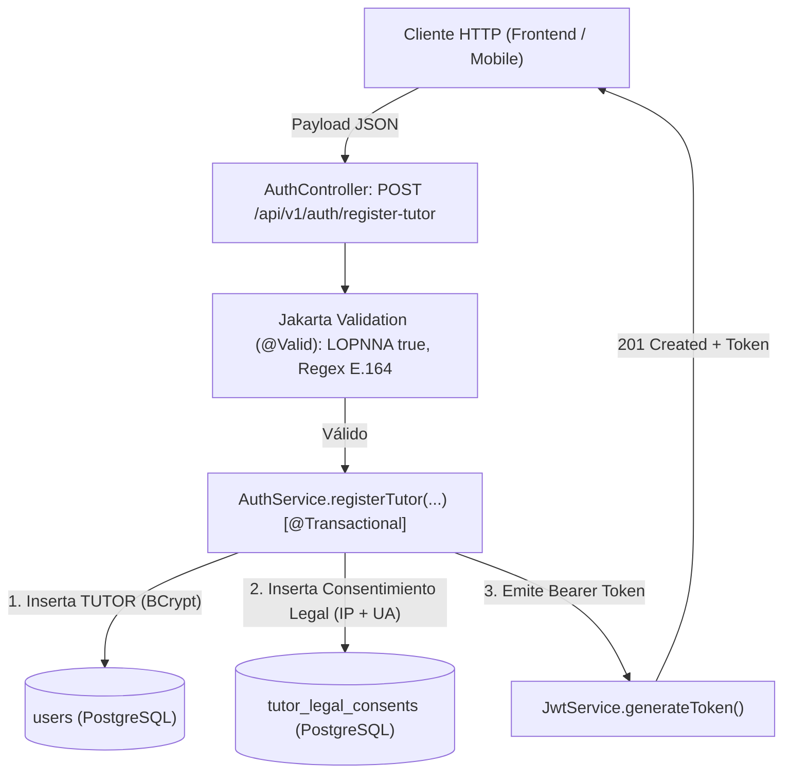

# Plan de Implementación: [TS-04] Onboarding Legal del Tutor y Registro de Consentimiento LOPNNA (Art. 65)

**ID Tarea:** TS-04  
**Tarjeta Trello:** [Ver en Trello](https://trello.com/c/H4BwQJ8y/41-ts-04-onboarding-legal-del-tutor-y-registro-de-consentimiento-lopnna-art-65) (ID: `6abbe1f3ce3aeea52b51eef2`)  
**Fecha:** 29 de septiembre de 2026  
**Sprint:** Sprint 1 — Cimientos Locales  
**Estado del Plan:** COMPLETADO  
**Agente Planificador:** trello_planner  
**Agente Implementador:** trello_implementer  

---

## 1. Contexto de Negocio y Justificación

* **Problema:** En la legislación venezolana y normativas internacionales de protección a la infancia (LOPNNA Art. 65, directivas FIFA), la exposición digital de la imagen, datos deportivos y métricas biométricas de menores de edad es un acto de estricta responsabilidad penal y civil. Un menor no puede registrarse solo ni autoautorizarse.
* **Solución:** Implementar un flujo de registro exclusivo y atómico para el tutor legal (`TUTOR`), donde en la misma transacción de creación de la cuenta se capture y preserve una constancia legal de consentimiento inmutable con su dirección IP de origen, huella User-Agent, versión del texto legal aceptado (`1.0`) y marca de tiempo ISO-8601.
* **Reglas Inmutables:**
  * Si `acceptLopnnaTerms` no es `true`, el registro se rechaza de inmediato con `400 Bad Request`.
  * El teléfono debe estar validado con formato internacional E.164 (ej: `+584121234567`) para habilitar el contacto directo por WhatsApp.
  * El email no puede estar duplicado (409 Conflict).

---

## 2. Alcance Técnico y Arquitectura

---

## 3. Modelo de Datos y Entidades JPA

Utiliza las tablas canónicas ya desplegadas por `dbmate` en `TS-02`:

### 3.1. Entidad JPA: `TutorLegalConsent`
* Archivo: `com.talentus.scout.domain.entity.TutorLegalConsent`
* Tabla: `tutor_legal_consents`
* Campos:
  * `id` (`UUID`, PK)
  * `tutor` (`@ManyToOne(fetch = FetchType.LAZY) @JoinColumn(name = "tutor_id") User`)
  * `acceptedLopnnaTerms` (`boolean`, no nulo, default `true`)
  * `termsVersion` (`String`, no nulo, default `"1.0"`)
  * `ipAddress` (`String`, no nulo, max 45)
  * `userAgent` (`String`, no nulo)
  * `acceptedAt` (`Instant`, no nulo)

---

## 4. Especificación Backend (Spring Boot 3 / Java 21)

### 4.1. DTOs
* `RegisterTutorRequest`:
  * `fullName` (`@NotBlank`, `@Size(max = 150)`)
  * `email` (`@NotBlank`, `@Email`, `@Size(max = 255)`)
  * `password` (`@NotBlank`, `@Size(min = 8, max = 100)`)
  * `phoneNumber` (`@NotBlank`, `@Pattern(regexp = "^\\+[1-9]\\d{7,14}$")`)
  * `acceptLopnnaTerms` (`@NotNull`, `@AssertTrue(message = "Debe aceptar obligatoriamente los términos de protección de menores LOPNNA Art. 65")`)
* `RegisterTutorResponse`:
  * `userId` (UUID)
  * `token` (String)
  * `tokenType` ("Bearer")
  * `expiresIn` (long)
  * `role` (UserRole.TUTOR)
  * `email` (String)
  * `fullName` (String)

### 4.2. Servicio de Negocio: `AuthService`
* `@Transactional`: Garantiza que si falla la inserción del consentimiento, el usuario no se cree (rollback completo).
* Métodos:
  * `registerTutor(RegisterTutorRequest request, String ipAddress, String userAgent): RegisterTutorResponse`

### 4.3. Controlador REST: `AuthController`
* `POST /api/v1/auth/register-tutor`
* Status: `201 Created`
* Extracción de IP:
  * Evalúa encabezado `X-Forwarded-For` (si existe, toma la primera IP).
  * Si no está presente, toma `request.getRemoteAddr()`.

---

## 5. Plan de Pruebas y Validación

1. **Pruebas Unitarias de Validación:**
   * Caso A: Registro exitoso con todos los campos correctos -> `201 Created` y token JWT válido emitido.
   * Caso B: `acceptLopnnaTerms = false` -> `400 Bad Request` con mensaje de error específico.
   * Caso C: `phoneNumber` inválido (ej: `04121234567` sin `+` ni código de país) -> `400 Bad Request`.
   * Caso D: `email` duplicado -> `409 Conflict`.
2. **Prueba de Persistencia en Base de Datos Local:**
   * Verificar mediante consulta directa a PostgreSQL que existen registros correspondientes en `users` y `tutor_legal_consents`.
3. **Prueba End-to-End con cURL:**
   * Petición POST a `http://localhost:8080/api/v1/auth/register-tutor`.

---

## 6. Checklist de Implementación Paso a Paso (Para `trello_implementer`)

- [x] **Paso 1:** Implementar entidad JPA `TutorLegalConsent` y su repositorio `TutorLegalConsentRepository`.
- [x] **Paso 2:** Implementar DTOs `RegisterTutorRequest` y `RegisterTutorResponse` con validaciones Jakarta.
- [x] **Paso 3:** Implementar excepciones de negocio personalizadas (`EmailAlreadyExistsException`) y controlador de excepciones (`GlobalExceptionHandler`).
- [x] **Paso 4:** Implementar método transaccional `registerTutor` en `AuthService`.
- [x] **Paso 5:** Exponer endpoint `POST /api/v1/auth/register-tutor` en `AuthController`.
- [x] **Paso 6:** Escribir pruebas unitarias e integración en `RegisterTutorTest` y validar con `./mvnw test`.
- [x] **Paso 7:** Probar en contenedor Docker en vivo y validar con cURL.
- [x] **Paso 8:** Hacer commit y push en los repositorios correspondientes.
- [x] **Paso 9:** Actualizar checklist del plan a `[x]` y mover la tarjeta `[TS-04]` a `in testing` mediante `move_to_testing.py 6abbe1f3ce3aeea52b51eef2`.

---

## 7. Criterios de Aceptación (Definition of Done - DoD)

1. El endpoint `POST /api/v1/auth/register-tutor` responde `201 Created` devolviendo JWT ante solicitudes válidas.
2. Si `acceptLopnnaTerms` es `false`, la API responde `400 Bad Request` y no persiste ningún registro.
3. El número de teléfono se valida con regex E.164.
4. El registro de consentimiento queda asentado en `tutor_legal_consents` con IP y User-Agent capturados.
5. Todas las pruebas pasan en `./mvnw test` sin fallos.
6. La tarjeta `[TS-04]` se traslada a `in testing` en Trello.
