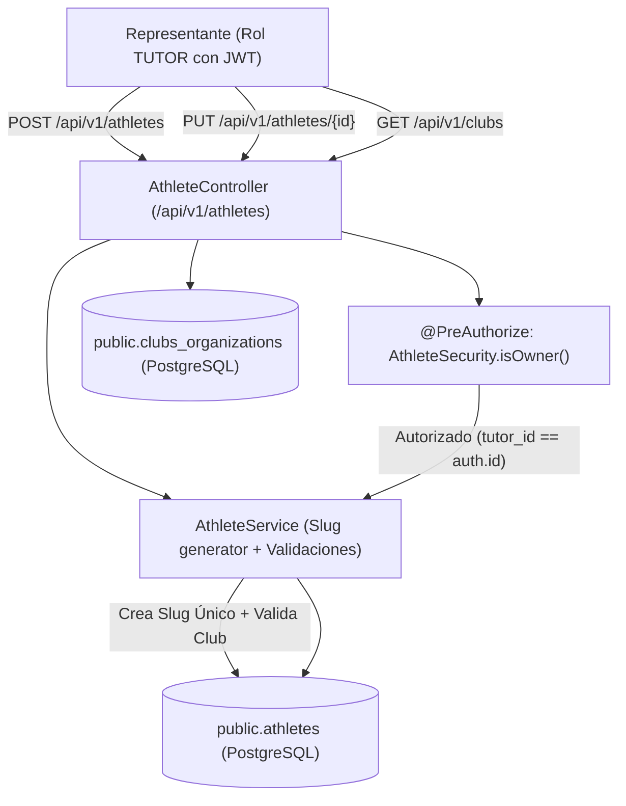

# Plan de Implementación: [TS-05] Cédula Deportiva del Atleta: Entidades JPA, DTOs y CRUD del Representante

**ID Tarea:** TS-05  
**Tarjeta Trello:** [Ver en Trello](https://trello.com/c/xXFdf9sE/42-ts-05-c%C3%A9dula-deportiva-del-atleta-entidades-jpa-dtos-y-crud-del-representante) (ID: `6abbe1f427b610df7d29dc9c`)  
**Fecha:** 29 de septiembre de 2026  
**Sprint:** Sprint 1 — Cimientos Locales  
**Estado del Plan:** COMPLETADO  
**Agente Planificador:** trello_planner  

---

## 1. Contexto de Negocio y Justificación

* **Problema:** Los representantes deportivos y tutores legales necesitan una interfaz confiable para cargar la información biométrica, deportiva y federativa de sus representados menores de edad, generando automáticamente su URL única amigable (`slug`) y garantizando aislamiento estricto de privacidad entre familias.
* **Solución:** Implementar las entidades canónicas `Athlete` y `ClubOrganization`, el generador de `slug` URL-safe único, y el CRUD seguro para el representante (`TUTOR`), blindado con validaciones de propiedad (`@PreAuthorize("@athleteSecurity.isOwner(#id, authentication)")`).
* **Reglas de Negocio Clave:**
  * **Aislamiento Multitenant por Tutor:** Un representante solo puede ver y editar sus propios atletas. La consulta de un atleta ajeno devuelve `403 Forbidden`.
  * **Slug Amigable y Único:** Generado en minúsculas, sin acentos ni caracteres especiales (ej: `gabriel-perez-10`). Si hay colisión, se asegura unicidad incremental.
  * **Validación de Edad:** La fecha de nacimiento debe corresponder a un menor de edad o categoría formativa juvenil (< 21 años).

---

## 2. Alcance Técnico y Arquitectura

---

## 3. Modelo de Datos y Entidades JPA

### 3.1. Entidad JPA: `ClubOrganization`
* Archivo: `com.talentus.scout.domain.entity.ClubOrganization`
* Tabla: `clubs_organizations`
* Campos:
  * `id` (`UUID`, PK)
  * `name` (`String`, no nulo, max 150)
  * `federationCode` (`String`, max 50)
  * `city` (`String`, no nulo, max 100)
  * `state` (`String`, no nulo, max 100)
  * `country` (`String`, no nulo, default 'Venezuela')
  * `logoUrl` (`String`)
  * `verifiedOfficial` (`boolean`, default false)
  * `createdAt` (`Instant`)

### 3.2. Entidad JPA: `Athlete`
* Archivo: `com.talentus.scout.domain.entity.Athlete`
* Tabla: `athletes`
* Campos:
  * `id` (`UUID`, PK)
  * `tutor` (`@ManyToOne User`, `nullable = false`)
  * `firstName` (`String`, max 100)
  * `lastName` (`String`, max 100)
  * `birthDate` (`LocalDate`, no nulo)
  * `gender` (`String`, default 'MALE')
  * `primaryPosition` (`String`, no nulo)
  * `secondaryPosition` (`String`)
  * `preferredFoot` (`String`, no nulo)
  * `nationality` (`String`, default 'Venezolana')
  * `secondaryPassports` (`String`)
  * `currentClub` (`@ManyToOne ClubOrganization`, opcional)
  * `federationLicenseNumber` (`String`)
  * `heightCm` (`BigDecimal`, precisión 5, escala 2)
  * `weightKg` (`BigDecimal`, precisión 5, escala 2)
  * `profilePhotoUrl` (`String`)
  * `bio` (`String`)
  * `slug` (`String`, unique, no nulo, max 120)
  * `isPublic` (`boolean`, default true)
  * `createdAt` (`Instant`)
  * `updatedAt` (`Instant`)

---

## 4. Especificación Backend (Spring Boot 3 / Java 21)

### 4.1. DTOs
* `CreateAthleteRequest`: Nombre, apellido, fecha de nacimiento, posiciones, lateralidad, medidas antropométricas, club ID opcional.
* `UpdateAthleteRequest`: Posiciones, club actual, altura, peso, bio, pierna hábil, licencia, pasaportes, visibilidad pública.
* `AthleteResponse`: Objeto completo serializable incluyendo datos del club, slug y métricas.
* `ClubResponse`: Resumen para autocompletado en frontend.

### 4.2. Componente de Seguridad: `AthleteSecurity`
* Bean: `@Component("athleteSecurity")`
* Método: `public boolean isOwner(UUID athleteId, Authentication authentication)`
* Comprueba si el atleta pertenece al usuario autenticado o si tiene rol `ADMIN`.

### 4.3. Endpoints REST
* `POST /api/v1/athletes` (Rol TUTOR): Crea el atleta y genera slug único.
* `GET /api/v1/athletes/my-athletes` (Rol TUTOR): Devuelve los atletas del representante autenticado.
* `GET /api/v1/athletes/{id}` (Rol TUTOR): Detalle del atleta con validación de propiedad.
* `PUT /api/v1/athletes/{id}` (Rol TUTOR): Actualización con validación de propiedad.
* `GET /api/v1/clubs` (Público / Autenticado): Listado de clubes oficiales registrados.

---

## 5. Plan de Pruebas y Validación

1. **Creación Exitosa de Atleta y Slug:**
   * Creación con `firstName: "Gabriel", lastName: "Pérez"` genera slug inicial `gabriel-perez` (o con sufijo si colisiona).
   * Persistencia en `athletes` verificada en PostgreSQL.
2. **Protección Multitenant / Ownership:**
   * Un tutor intenta consultar o modificar con `PUT /api/v1/athletes/{id}` el atleta de otro tutor -> Recibe `403 Forbidden`.
3. **Validación de Datos:**
   * Atleta con fecha de nacimiento futura o mayor de 21 años es rechazado con `400 Bad Request`.
4. **Listado de Atletas del Tutor:**
   * `GET /api/v1/athletes/my-athletes` devuelve únicamente los atletas del usuario autenticado.

---

## 6. Checklist de Implementación Paso a Paso (Para `trello_implementer`)

- [x] **Paso 1:** Implementar entidades JPA `ClubOrganization` y `Athlete` con sus repositorios.
- [x] **Paso 2:** Implementar componente generador de slug `SlugService`.
- [x] **Paso 3:** Implementar bean de seguridad `@Component("athleteSecurity")` para validación de propiedad.
- [x] **Paso 4:** Implementar DTOs `CreateAthleteRequest`, `UpdateAthleteRequest`, `AthleteResponse`, `ClubResponse`.
- [x] **Paso 5:** Implementar lógica de negocio en `AthleteService` y `ClubService`.
- [x] **Paso 6:** Exponer controladores `AthleteController` y `ClubController`.
- [x] **Paso 7:** Agregar seed local de clubes venezolanos en `DataInitializer` (ej: Caracas FC, Dep. Táchira, Dep. Miranda).
- [x] **Paso 8:** Escribir pruebas unitarias e integración en `AthleteControllerTest` y validar con `./mvnw test`.
- [x] **Paso 9:** Reconstruir y validar contenedor en Docker Compose con cURL.
- [x] **Paso 10:** Hacer commit y push en GitHub en `talentus-scout-be`.
- [x] **Paso 11:** Actualizar checklist del plan a `[x]` y mover la tarjeta `[TS-05]` a `in testing` mediante `move_to_testing.py 6abbe1f427b610df7d29dc9c`.

---

## 7. Criterios de Aceptación (Definition of Done - DoD)

1. El CRUD de atletas funciona correctamente y persiste en la tabla `athletes`.
2. El slug generado es URL-safe, en minúsculas y estrictamente único.
3. Un tutor no puede acceder ni modificar los atletas de otro tutor (`403 Forbidden`).
4. El endpoint `GET /api/v1/clubs` responde el listado de clubes para autocompletado.
5. El 100% de las pruebas automatizadas pasan en `./mvnw test`.
6. La tarjeta `[TS-05]` se traslada a `in testing` en Trello.
